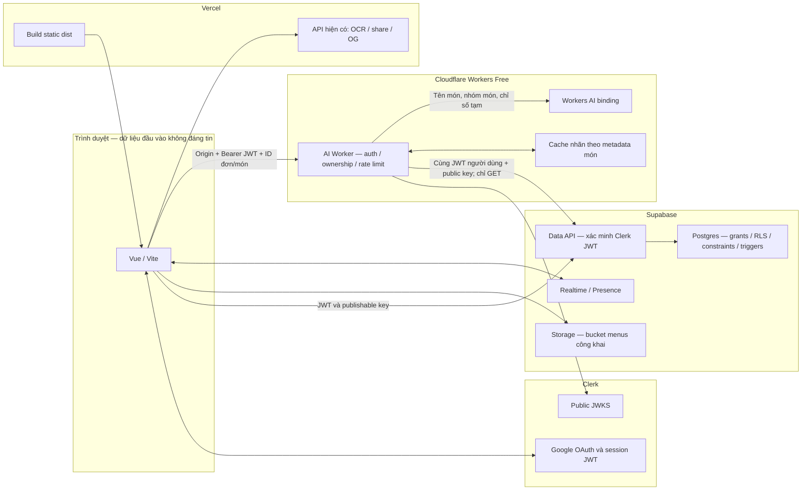

# Kiến trúc hệ thống

[Mục lục](../README.md) · [Dữ liệu](data-model.md) · [API](api.md) · [Triển khai](deployment.md) · [Bảo mật](../security/README.md)

Vue/Vite chạy trong trình duyệt, gọi Supabase trực tiếp bằng phiên Clerk. Postgres RLS, constraint và trigger bảo vệ dữ liệu. Cloudflare Worker là ngoại lệ dịch vụ AI đã được duyệt: chỉ đọc ngữ cảnh món của chủ đơn và tạo các nhãn gợi ý; người dùng tự chọn và lưu đánh giá qua Supabase. Không có service-role, Clerk secret hay webhook trong luồng này.

## Triển khai và ranh giới tin cậy



Tách build/deploy app và Worker: Vercel không cài hoặc chạy package `ai-worker/` để build Vue; Worker có lockfile/Wrangler riêng và nhập contract từ `shared/feedback.js`. Đổi URL Worker cần rebuild frontend vì biến `VITE_*` được đóng vào bundle.

Repo hiện có các hàm Vercel ở [`api/`](../../api/) và rewrite ở [`vercel.json`](../../vercel.json). OCR cũ vẫn dùng Gemini; Worker này không thay thế hoặc bảo vệ các endpoint đó. Xem [phạm vi tồn đọng](../security/README.md#giới-hạn-và-cấu-hình-chưa-kiểm-chứng).

## Token và quyền sở hữu

```mermaid
sequenceDiagram
  participant U as Người dùng / Vue
  participant C as Clerk
  participant W as AI Worker
  participant S as Supabase / Postgres
  participant A as Workers AI
  U->>C: Google sign-in; lấy session.getToken()
  C-->>U: Session JWT ngắn hạn
  U->>S: CRUD + JWT + publishable key
  S->>S: Native Clerk auth → role authenticated → RLS theo sub
  S-->>U: Các dòng được phép
  U->>W: POST IDs + Bearer JWT + Origin
  W->>C: Public JWKS từ issuer cấu hình cố định
  W->>W: RS256 / issuer / thời hạn / azp = Origin
  W->>W: Giới hạn theo user và dịch vụ
  W->>S: GET order và order_items bằng cùng JWT
  S->>S: Áp dụng grants / RLS
  S-->>W: Ngữ cảnh được phép đọc
  W->>W: orders.user_id = sub; từng item đúng đơn/menu; ngày VN hợp lệ
  alt Cache nhãn còn hợp lệ
    W-->>U: Nhãn đã kiểm tra
  else Cache miss
    W->>A: Tên/nhóm món, không JWT/ID/ghi chú
    A-->>W: JSON gợi ý
    W->>W: Kiểm tra cấu trúc; lỗi/quota/timeout → nhãn dự phòng
    W-->>U: version 1, item IDs, labels, source
  end
  U->>U: Người dùng chọn nhãn, sao và ghi chú
  U->>S: Ghi dish_reviews bằng JWT người dùng
  S->>S: RLS kiểm chủ đơn và ngày; constraints kiểm nội dung
```

Nhóm tin nhau được đọc nhiều dữ liệu chung. Quyền `SELECT` không đồng nghĩa quyền yêu cầu AI hoặc sửa đơn: Worker phải kiểm chủ đơn riêng; DB vẫn kiểm quyền ghi. Đặt hộ ghi `orders.user_id` là người được đặt, còn `placed_by` là người thực hiện. Người được đặt mới thanh toán và đánh giá.

Auth Worker dùng public JWKS nên không kiểm tra việc thu hồi phiên theo thời gian thực. Token đã ký có thể còn hiệu lực tới `exp`; giữ vòng đời phiên ngắn trong Clerk và không lưu JWT vào log/cache ứng dụng.

## Nguồn code

- [`src/lib/supabase.js`](../../src/lib/supabase.js): token phiên hiện tại cho từng request.
- [`ai-worker/src/index.ts`](../../ai-worker/src/index.ts): thứ tự middleware và xử lý lỗi.
- [`auth.ts`](../../ai-worker/src/auth.ts), [`database.ts`](../../ai-worker/src/database.ts), [`suggestions.ts`](../../ai-worker/src/suggestions.ts): xác thực, quyền, inference/cache.
- [`shared/feedback.js`](../../shared/feedback.js): contract nhãn dùng chung; [API](api.md) mô tả request/response.
