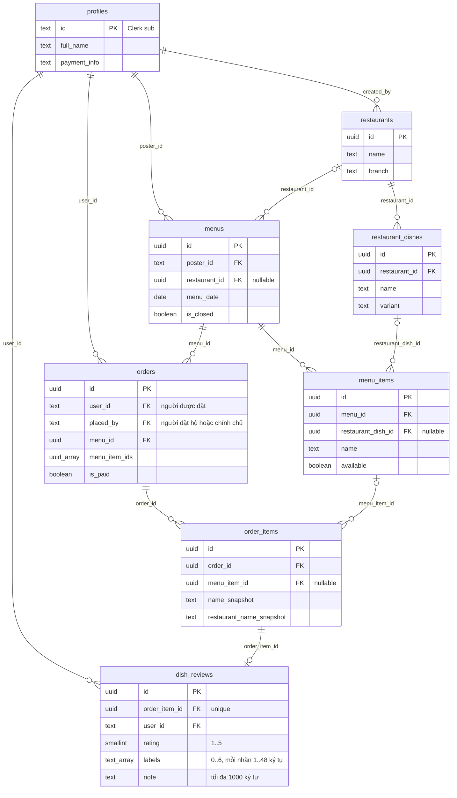

# Mô hình dữ liệu và quyền

[Kiến trúc](README.md) · [API](api.md) · [Bảo mật](../security/README.md)

Nguồn chính là chuỗi [`supabase/migrations/`](../../supabase/migrations/), gồm schema gốc, Storage, đặt hộ, chốt đơn và [`20261003080019_lunch_catalog_reviews.sql`](../../supabase/migrations/20261003080019_lunch_catalog_reviews.sql). Đây là schema trong repository, chưa phải biên bản xác minh database production.

Món catalog có danh tính theo quán + tên + biến thể. Hai quán cùng bán “Cơm gà” không chia sẻ điểm đánh giá. Menu và món có thể chưa liên kết catalog; không ép gán sai quán/món. `order_items` giữ snapshot để lịch sử không mất tên món khi catalog thay đổi. Đơn text cũ được giữ ở dạng chưa liên kết; không đoán danh tính bằng AI.

## Quyền thực thi trong database

| Dữ liệu | Đọc | Ghi và ràng buộc |
| --- | --- | --- |
| `profiles` | Theo policy nền trong migration | Chỉ profile có ID bằng `auth.jwt()->>'sub'` |
| `menus` | Theo policy nền | Người đăng sửa/chốt/mở lại; danh tính quán/ngày đã dùng bị trigger khóa |
| `orders` | Nhóm authenticated theo policy nền | Cho đặt hộ; người nhận sở hữu đơn, chỉ chủ đơn sửa/trả/xóa trong điều kiện cho phép |
| `restaurants`, `restaurant_dishes` | Authenticated | Người tạo sửa; unique món trong từng quán; không gộp theo tên giữa quán |
| `menu_items` | Authenticated | Đồng bộ trong giao dịch menu của poster; không cho tự đổi liên kết đã được đặt |
| `order_items` | Authenticated | Trigger đồng bộ từ đơn; kiểm parent/menu và quyền trong cùng giao dịch; không nhận snapshot tùy ý |
| `dish_reviews` | Authenticated | Chủ đơn, từ `menu_date` đến hôm nay giờ VN; một review mỗi order item |

Clerk ID là text: không dùng `auth.uid()` (UUID). RLS được áp dụng tại Data API với user JWT, kể cả khi caller là Worker. Views thống kê dùng `security_invoker = true`; RPC `save_lunch_menu` và các hàm/trigger dùng `SECURITY INVOKER` với `search_path` cố định.

Các trường `catalog_tx`, `created_tx`, `items_tx` là dấu giao dịch do DB quản lý cho đồng bộ menu/order item. Client không được tự sử dụng chúng như quyền hạn. Foreign key ghép `(order_id, menu_id)` và `(menu_item_id, menu_id)` chặn nối item sang menu khác. Guard kiểm lại danh tính/quán/snapshot; RLS giới hạn người được phép thực hiện.

`is_closed` chặn đặt mới và sửa nội dung đơn. Chính chủ vẫn tự tick thanh toán và đánh giá sau khi chốt, nếu ngày menu hợp lệ. Người đăng không có quyền tick hộ. Thanh toán luôn là boolean do người đặt xác nhận, không phải chứng cứ giao dịch ngân hàng.

Storage bucket `menus` là public theo [`0002_storage.sql`](../../supabase/migrations/0002_storage.sql): URL ảnh có thể được đọc công khai; upload/xóa yêu cầu thư mục đầu bằng Clerk `sub`. Đừng hiểu RLS của bảng là cơ chế làm ảnh đã public trở thành riêng tư.
