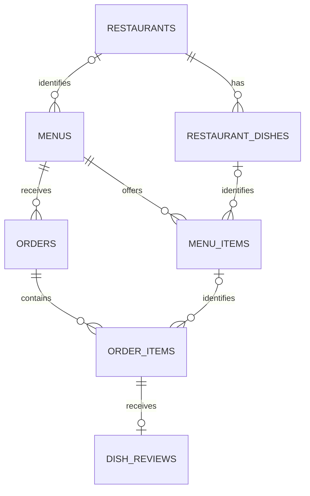
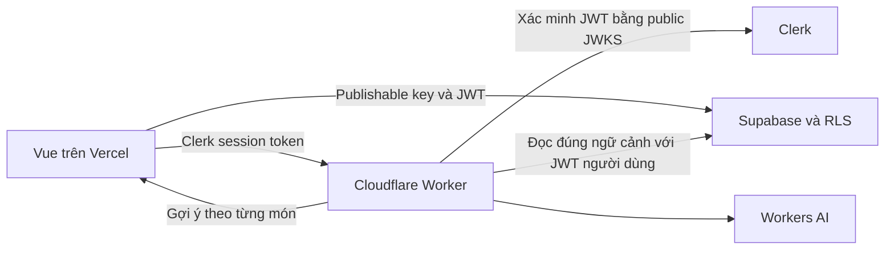

# Thiết kế UI/UX từ main — Quán, món ăn, đánh giá và Cloudflare AI

Ngày: 2026-10-03, giờ Việt Nam. Trạng thái: **đã được chủ dự án duyệt trong hội thoại ngày 2026-10-03**; triển khai từ main e13f916.

## 1. Mục tiêu và yêu cầu đã xác nhận

App phục vụ nhóm nội bộ dưới 25 người. Mục tiêu là giúp người đăng điều phối bữa trưa dễ hơn, người đặt nhớ được ngày nào ăn gì, và cả nhóm biết **món nào của quán nào hợp khẩu vị**.

Yêu cầu từ chủ dự án:

- Review toàn bộ UI/UX theo hướng tối giản.
- Khi đăng ảnh, người đăng chọn quán để làm cơ sở cho đánh giá về sau.
- Có bảng món ăn; cùng tên món ở hai quán phải là hai đối tượng khác nhau.
- Đánh giá từng món. **AI dựa vào tên món để gợi ý các nhận xét phù hợp ngay trên màn hình**, người dùng chọn và có thể ghi chú tự do.
- Lịch sử chuyển sang lịch, xem ngày nào đã đặt món gì.
- Bổ sung công cụ cho người đăng và người đặt.
- **Làm song song UI/dữ liệu và Cloudflare AI**, không đợi hoàn thành toàn bộ UI mới bắt đầu AI.
- Code Cloudflare nằm trong **`ai-worker/` tại root repo app**, có cấu hình và lệnh deploy riêng. App đặt cơm gọi API của Worker.
- Inference dùng hạn mức tài khoản Cloudflare của chủ dự án. Người dùng dùng phiên đăng nhập app hiện có, chỉ thấy các gợi ý đánh giá; không có bước cấu hình AI hay màn hình quota.
- **Làm xong phần triển khai rồi mới test**, hạn chế kiểm thử rải rác trong lúc phát triển. Gom kiểm thử theo luồng hoàn chỉnh ở cuối, chỉ kiểm lại phần liên quan sau khi sửa lỗi.

“Gợi ý AI” ở đây là lựa chọn nhận xét theo món, ví dụ “Thịt mềm”, “Hơi khô”. Người dùng quyết định nhận xét và số sao. Cá nhân hóa trong đợt đầu có nghĩa là gợi ý riêng theo **từng món đang đánh giá**; chưa cần xây hồ sơ khẩu vị bằng máy học.

## 2. Cơ sở review hiện tại

Đã fetch và checkout **`origin/main` tại commit `e13f916aabcc43c7a824654f3487f35bf91dac66`**, trong worktree `/Users/nhatminh/.codex/worktrees/lunch-ui-ux-review/mevn-restaurant`. Đã đọc router, các trang, navigation, design tokens, composables, luồng lưu đơn/menu, OCR và migration từ checkout này. Đây là baseline cho toàn bộ đề xuất; các tính năng ở nhánh `nhat` không được tính là đã có trên main.

Theo yêu cầu mới nhất của chủ dự án, tiếp tục review trực tiếp từ source và không chạy thêm GitNexus. Đây là review sơ bộ từ code và tài liệu; **chưa walkthrough app đã đăng nhập trên trình duyệt, chưa đo thời gian thao tác hoặc kiểm tra hình ảnh ở các kích thước màn hình**. Những đánh giá về độ dễ dùng cần xác nhận bằng bước review browser bên dưới.

Các quan sát có căn cứ:

| Quan sát | Hệ quả cho thiết kế | Bằng chứng |
|---|---|---|
| Main có sáu mục navigation ở header, nền giấy ấm/xanh lá và khung nội dung mặc định 760px | Gom theo bốn công việc chính; bố cục lịch và quản lý cần rộng hơn trên desktop | [App.vue](/Users/nhatminh/.codex/worktrees/lunch-ui-ux-review/mevn-restaurant/src/App.vue:15), [tokens](/Users/nhatminh/.codex/worktrees/lunch-ui-ux-review/mevn-restaurant/src/styles/tokens.css:44) |
| Hôm nay hiển thị ảnh đầy đủ, MenuBoard và danh sách đơn trong từng thẻ | Thẻ tóm tắt giúp so sánh nhiều quán; chi tiết và thao tác theo đơn mở khi cần | [TodayPage](/Users/nhatminh/.codex/worktrees/lunch-ui-ux-review/mevn-restaurant/src/pages/TodayPage.vue:235) |
| Form sửa đơn ở Hôm nay cho nhập tên món tự do và chưa kiểm tra `is_closed` tại nút/form, khác với trang menu | P0: dùng cùng luồng chọn món và trạng thái chốt; DB vẫn là rào bảo mật | [TodayPage](/Users/nhatminh/.codex/worktrees/lunch-ui-ux-review/mevn-restaurant/src/pages/TodayPage.vue:317), [MenuPage](/Users/nhatminh/.codex/worktrees/lunch-ui-ux-review/mevn-restaurant/src/pages/MenuPage.vue:588) |
| Chưa có thực thể quán/món; một đơn có thể chứa nhiều tên món trong `item_text` | Cần danh tính ổn định cho quán, món và từng món trong đơn trước khi tính điểm | [Schema](/Users/nhatminh/.codex/worktrees/lunch-ui-ux-review/mevn-restaurant/supabase/migrations/0001_schema_rls.sql:13), [submitOrder](/Users/nhatminh/.codex/worktrees/lunch-ui-ux-review/mevn-restaurant/src/pages/MenuPage.vue:252) |
| Lịch sử đã gom theo `menu_date` giảm dần, có banner chưa trả nhưng vẫn là danh sách; thanh toán mở qua trang menu | Chuyển phần ngày sang lịch tháng, giữ công nợ riêng, thêm thao tác đơn của mình ở chi tiết ngày | [HistoryPage](/Users/nhatminh/.codex/worktrees/lunch-ui-ux-review/mevn-restaurant/src/pages/HistoryPage.vue:49) |
| Tiêu đề menu tự tạo từ ngày; dashboard gom người chưa trả và chỉ hiển thị tiêu đề menu | Hiển thị quán để phân biệt menu cùng ngày; bộ lọc mới phải dùng ID | [PostMenuPage](/Users/nhatminh/.codex/worktrees/lunch-ui-ux-review/mevn-restaurant/src/pages/PostMenuPage.vue:19), [useDashboard](/Users/nhatminh/.codex/worktrees/lunch-ui-ux-review/mevn-restaurant/src/composables/useDashboard.js:26) |
| Sửa menu hiện đưa nguyên `menu.note`, kể cả JSON OCR, vào TextArea | Cần editor món có cấu trúc để người đăng sửa tên/giá/nhóm rõ ràng | [MyMenusPage](/Users/nhatminh/.codex/worktrees/lunch-ui-ux-review/mevn-restaurant/src/pages/MyMenusPage.vue:74), [TextArea](/Users/nhatminh/.codex/worktrees/lunch-ui-ux-review/mevn-restaurant/src/pages/MyMenusPage.vue:213) |
| Đã có bảng kê theo món, QR, nháp, sao chép link và copy bảng kê để chốt đơn/mở lại | Cải thiện vị trí và nhãn của các chức năng này; editor có cấu trúc, hết món, tái dùng và CSV là nâng cấp mới | [MenuPage](/Users/nhatminh/.codex/worktrees/lunch-ui-ux-review/mevn-restaurant/src/pages/MenuPage.vue:306), [Migration chốt đơn](/Users/nhatminh/.codex/worktrees/lunch-ui-ux-review/mevn-restaurant/supabase/migrations/0004_close_ordering.sql:4) |
| OCR hiện gọi `/api/ocr` trên Vercel và Gemini; handler chưa có xác thực hoặc giới hạn gọi | Worker cần auth và giới hạn inference; chuyển OCR sau khi benchmark đạt yêu cầu | [gemini.js](/Users/nhatminh/.codex/worktrees/lunch-ui-ux-review/mevn-restaurant/src/lib/gemini.js:29), [ocr.js](/Users/nhatminh/.codex/worktrees/lunch-ui-ux-review/mevn-restaurant/api/ocr.js:58) |
| Tài liệu gốc ghi không backend nhưng repo đã có `/api`; chủ dự án đã yêu cầu Worker AI | Cập nhật ngoại lệ dịch vụ AI, giữ CRUD ở Supabase và frontend static | [AGENTS.md](/Users/nhatminh/.codex/worktrees/lunch-ui-ux-review/mevn-restaurant/AGENTS.md:22), [vercel.json](/Users/nhatminh/.codex/worktrees/lunch-ui-ux-review/mevn-restaurant/vercel.json:1) |

Không suy ra trạng thái production hoặc schema đang chạy chỉ từ migration trong repo.

Baseline main chốt đơn thủ công qua **`menus.is_closed`**: copy bảng kê → xác nhận chốt, poster có thể mở lại; thanh toán của chủ đơn vẫn hoạt động sau khi chốt. Kế hoạch giữ cơ chế này và làm nhãn “Sao chép & chốt đơn” rõ hơn. Không đưa cơ chế deadline của nhánh khác vào baseline.

## 3. Ba hướng UI tối giản để chọn

| Hướng | Đặc điểm | Đánh đổi |
|---|---|---|
| **A — Bữa trưa hằng ngày, đề xuất** | Nền trắng ấm, chữ đậm dễ đọc, một màu xanh cho hành động. Menu gọn, lịch rõ, công cụ nâng cao mở khi cần | Cần tổ chức tốt các chi tiết để người đăng vẫn tìm được công cụ nhanh |
| B — Bảng điều phối | Nền trắng trung tính, nhiều hàng/bảng, ưu tiên quản lý đơn và thao tác bằng bàn phím | Hiệu quả cho người đăng trên desktop; kém thân thiện hơn khi chọn món trên điện thoại |
| C — Sổ quán và món | Quán, món và nhận xét nổi bật; bố cục thiên về khám phá | Hợp mục tiêu tìm món ngon; dễ làm màn hình Hôm nay đông thông tin và phụ thuộc ảnh |

Đề xuất dùng **A làm nền**, bảng điều phối của B trong Quản lý, và thông tin món/quán của C ở trang chi tiết. Chưa tạo mockup hay coi hướng A là đã được chủ dự án duyệt.

Nguyên tắc thiết kế:

- Mỗi vùng có một hành động chính. Thông tin quán, món, trạng thái nhận đơn đứng trước các số liệu phụ.
- Một font dễ đọc tiếng Việt, số tiền/ngày có độ rộng ổn định; dùng chung tokens về spacing, radius và trạng thái.
- Giảm bóng đổ, gradient, badge lặp và animation trang trí. Giữ phản hồi chọn món, tải, lưu và lỗi rõ ràng.
- Vùng chạm tối thiểu 44px; màu trạng thái đi kèm chữ/icon; focus bàn phím nhìn thấy được.
- Thông tin calo/mô tả dài nằm trong Chi tiết; không chen vào luồng đặt và đánh giá.
- Loading, empty, lỗi kết nối và thiếu quyền là những trạng thái riêng. Retry giữ dữ liệu người dùng vừa nhập.

## 4. Điều hướng đề xuất

**Hôm nay · Lịch ăn · Quán & món · Quản lý**, dùng thống nhất trên desktop và mobile.

- Hôm nay: menu đang mở, quán, đơn của tôi hôm nay và các việc cần làm.
- Lịch ăn: lịch đặt cơm cá nhân, chi tiết ngày, đánh giá và thanh toán đơn của mình.
- Quán & món: danh sách quán, món của từng quán, điểm đánh giá và nhận xét trong nhóm.
- Quản lý: menu đã đăng, tổng hợp đơn, bảng kê đặt quán và theo dõi thanh toán.
- “Đăng menu” là nút rõ trên Hôm nay và Quản lý; vẫn mở được bằng một lần bấm. Ai đăng nhập cũng dùng được.
- Hồ sơ/chuyển khoản giữ trong menu tài khoản. Các URL cũ như `/history`, `/post`, `/dashboard` vẫn cần hoạt động hoặc redirect tương thích.

## 5. Kế hoạch review toàn bộ màn hình

Review theo công việc thực tế, ghi vấn đề, mức ưu tiên, ảnh minh họa và tiêu chí sửa. P0 là sai dữ liệu/quyền hoặc không hoàn thành công việc; P1 là luồng chính; P2 là tiện ích bổ sung.

| Màn hình/luồng | Câu hỏi cần kiểm tra | Thay đổi dự kiến | Tiêu chí nghiệm thu |
|---|---|---|---|
| Shell/navigation | Có biết đang ở đâu, nút đăng menu có dễ tìm, thanh đáy có che nội dung? | Bốn khu vực; thống nhất canvas, trạng thái active, safe area | Dùng được ở 360/390/768/1280px, không tràn ngang hoặc che CTA |
| Đăng nhập/guest | Chọn món rồi đăng nhập có mất nháp? Có hiểu ai sở hữu đơn đặt hộ? | Giữ nháp theo tài khoản và menu; quay lại đúng bước | Đăng nhập/đổi tài khoản không trộn nháp, không tự gửi đơn |
| Hôm nay | Có phân biệt quán, menu đang mở/đã chốt và đơn đã đặt? | Thẻ ưu tiên tên quán, trạng thái nhận đơn, preview vài món; vùng đơn của tôi | Hai menu cùng tiêu đề vẫn phân biệt được; menu đã chốt không mở form sửa nội dung |
| Chi tiết menu/chọn món | Có chọn nhanh, hiểu giá và xem lại đơn? | Giữ MenuBoard bắt buộc với menu có cấu trúc; ảnh gốc là tham chiếu; điểm món gọn | Không nhập tay ở menu có cấu trúc; ghi chú và đặt hộ vẫn dùng được |
| Đăng ảnh/text + OCR | Có chọn quán, kiểm tra nhận diện và sửa lỗi trước đăng? | Chọn quán ở bước nguồn; rà soát món và liên kết catalog ở bước tiếp | Có thể hoàn thành khi AI lỗi; không bịa giá/món hoặc tự chọn quán sai |
| Sửa menu/quản lý | Sửa món có còn phải đọc JSON; có biết copy bảng kê sẽ chốt đơn? | Editor có cấu trúc; workspace Món/Người/Chưa trả; tái dùng menu | Giữ chốt/mở lại; bổ sung kiểm tra danh tính món đã có đơn ở DB và xử lý đơn vừa phát sinh |
| QR/thanh toán | Có đúng người nhận và đúng chủ đơn; có hiểu thao tác tự xác nhận? | Thanh toán gắn với đơn, nhất quán ở menu/lịch | Người đặt hộ và người đăng không tick hộ; thanh toán vẫn được sau khi chốt |
| Lịch sử/lịch ăn | Có tìm được bữa ngày cụ thể, nhiều menu/ngày và món chưa đánh giá? | Lịch tháng + chi tiết ngày; công nợ tách khỏi thứ tự lịch | Ngày dựa vào `menu_date` giờ VN; dữ liệu cũ vẫn đọc được |
| Quán/món/đánh giá | Có biết đang đánh giá món của quán nào; gợi ý có sát món? | Catalog theo quán, đánh giá từng món, chips AI và ghi chú | Món cùng tên khác quán không dùng chung điểm; chỉ lưu lựa chọn đã xác nhận |
| Hồ sơ và trạng thái chung | Form chuyển khoản có rõ; lỗi có cách tiếp tục; dialog có focus đúng? | Tinh gọn hồ sơ, kiểm tra component chung trên mọi trang | ESC/focus/back hoạt động; input lỗi không mất nội dung |

Kịch bản walkthrough: một người đăng tạo hai menu của hai quán cùng ngày; một người đặt hai món và đặt hộ; poster sao chép bảng kê/chốt rồi mở lại; người được đặt hộ thanh toán sau khi chốt; sau bữa trưa đánh giá; tuần sau tìm lại bữa đó qua lịch. Chạy thêm menu text, OCR sai, mạng chậm, đổi tài khoản và lỗi AI.

## 6. Trải nghiệm cho người đăng

### 6.1. Đăng menu trong hai trạng thái

1. **Nguồn menu + thông tin:** chọn quán có sẵn hoặc thêm quán, ảnh/text và ngày. Khi chưa rõ quán, có thể tiếp tục với “Chưa xác định quán”; phần đó chưa tham gia thống kê theo quán.
2. **Kiểm tra + đăng:** rà soát OCR, sửa tên/giá/nhóm/khả dụng, kiểm tra liên kết từng món với catalog của quán đã chọn, xem trước rồi mở nhận đơn.

Chọn quán là lựa chọn của người đăng. OCR có thể đưa tên quán thành gợi ý nhưng phải xác nhận. Đổi quán trước khi đăng phải xóa các liên kết món của quán cũ và yêu cầu rà soát lại.

Khi đối chiếu catalog, tên và biến thể trùng chính xác trong **cùng quán** có thể đưa ra ứng viên. Trường hợp không rõ, giữ món chưa liên kết để người đăng xác nhận hoặc tạo món mới. Không tự gộp “Cơm gà xối mỡ” với “Cơm gà chiên” bằng AI.

Sau khi menu đã có đơn, liên kết quán/món đã xác nhận của các mục đã đặt phải được khóa để lịch sử và đánh giá không đổi đối tượng. Đây là ràng buộc mới của thiết kế catalog, không phải tính năng đã có trên main. Editor mới cần cảnh báo rõ khi thay đổi tên/giá ảnh hưởng đơn hiện có; tính tiền vẫn chỉ áp dụng với menu có cấu trúc và tên món khớp chính xác.

### 6.2. Bảng điều phối theo menu

- Tổng số phần, số người và trạng thái nhận đơn ở đầu workspace.
- “Theo món”: số phần, ghi chú từng người, bảng kê dễ sao chép cho quán. Nâng vị trí của chức năng tổng hợp đã có.
- “Theo người”: người được đặt, các món, ghi chú, trạng thái tự xác nhận thanh toán.
- “Chưa trả”: nhóm theo người, lọc theo menu ID/quán/ngày. Tổng tiền chỉ hiện khi dữ liệu giá đáng tin cậy; trường hợp khác để trống.
- Sửa menu bằng editor có cấu trúc; bổ sung bật/tắt món hết cho menu mới. Kiểm tra xung đột khi vừa có đơn để không đổi các liên kết đã được đặt.
- Nút **“Sao chép & chốt đơn”** khi menu đang mở, “Sao chép bảng kê” khi đã chốt, và “Mở lại nhận đơn” cho poster. Giữ xác nhận và thông báo lỗi như luồng main; luôn hiển thị trạng thái thật của menu.
- Nút sao chép link tách riêng, không chốt đơn. Người dùng chủ động gửi link/bảng kê.

### 6.3. Tính năng thêm cho người đăng

- Tái dùng menu của một quán làm **nháp cho ngày mới**, yêu cầu kiểm tra lại giá và món còn bán; menu mới bắt đầu ở trạng thái mở.
- Bản nháp lưu rõ trạng thái, gắn với tài khoản; quay lại tiếp tục và không nhầm dữ liệu khi đăng xuất/đổi tài khoản.
- Xuất bảng kê CSV theo quán/món/người, phục vụ gửi đơn và đối chiếu.
- Xem món được đánh giá tốt, nhận xét gần đây và số lượt phản hồi của từng quán.
- Cảnh báo mềm về quán có tên gần giống/chi nhánh khác trước khi tạo mới.

Editor có cấu trúc, bật/tắt món hết, tái dùng và xuất CSV là nâng cấp mới so với main; sửa menu text/JSON, tổng hợp món, lưu nháp và chốt/mở lại là các chức năng đã có cần cải thiện.

## 7. Đánh giá món với lựa chọn AI theo tên món

### 7.1. Màn hình đánh giá

Từ đơn của mình trong Hôm nay hoặc chi tiết ngày trên lịch, người dùng mở “Đánh giá món”. Mỗi món có tên, tên quán và ngày đặt; đánh giá riêng ngay tại món đó.

- Chọn 1–5 sao, không chọn sẵn.
- Hiện 4–6 lựa chọn nhận xét ngắn do AI gợi ý theo tên món. Cho chọn nhiều, bật/tắt từng lựa chọn.
- Có lựa chọn tích cực và tiêu cực, tránh chỉ gợi ý lời khen.
- Ô **“Ghi chú thêm”** nhập tự do, không bắt buộc, giới hạn dự kiến 1.000 ký tự.
- Lưu, sửa hoặc xóa đánh giá của chính mình. Không tự lưu khi chỉ mở màn hình.
- Người dùng có thể chấm sao và ghi chú khi AI đang tải hoặc không hoạt động.

Ví dụ minh họa lựa chọn, không phải đánh giá thật:

| Tên món | Gợi ý phù hợp |
|---|---|
| Sườn nướng | Thịt mềm · Hơi dai · Ướp vừa · Hơi mặn · Thơm mùi nướng · Hơi khô |
| Canh chua | Vị chua vừa · Hơi chua · Nước canh đậm vị · Hơi nhạt · Vừa nóng · Hơi nguội |
| Gà chiên | Da giòn · Da chưa giòn · Thịt mềm · Hơi khô · Nêm vừa · Hơi mặn |

AI dùng tên món của phần đã đặt; nhóm món là ngữ cảnh phụ nếu có. Không dùng điểm số của người khác để viết gợi ý, không tự suy ra số sao và không biến tên món thành một nhận định rằng đồ ăn ngon/dở. Chỉ lựa chọn người dùng chọn và ghi chú họ nhập được lưu thành feedback.

Chips đã chọn giữ nguyên khi retry hoặc AI trả về chậm. Nhãn lựa chọn được lưu cùng feedback để thay phiên bản prompt không làm đổi nghĩa nhận xét cũ.

### 7.2. Khi nào và ai được đánh giá

- Đánh giá là hành động sau khi ăn; không mở popup đánh giá ngay sau khi vừa đặt buổi sáng.
- Ngày menu ở tương lai chưa có thao tác đánh giá. Với ngày đã đến, người dùng chủ động mở đánh giá khi đã ăn; không suy ra đã giao món từ `is_paid` hoặc thời gian chốt.
- Chỉ **chủ đơn/người được đặt hộ** đánh giá món trong đơn của họ. Người đặt giúp và người đăng không đánh giá hộ.
- Đánh giá độc lập với thanh toán; chưa tick đã trả vẫn có thể đánh giá.
- Một feedback cho mỗi món trong mỗi đơn; chỉnh sửa cập nhật feedback đó, không tạo thêm lượt tính điểm.

### 7.3. Đọc kết quả đánh giá

- Điểm trung bình và số lượt đánh giá đặt cạnh món của đúng quán.
- Tách số lượt đánh giá với số người khác nhau đã đánh giá; tránh coi một người ăn nhiều lần là nhiều người độc lập.
- Có ít dữ liệu thì ghi “Ít lượt đánh giá”. Đề xuất chỉ dùng nhãn so sánh/xếp hạng sau khi có ít nhất 3 người khác nhau phản hồi; ngưỡng cần kiểm chứng trong nhóm.
- Hiện nhận xét gần đây và các tag thường được chọn, cả tốt lẫn chưa tốt. Nội bộ người đăng nhập mới xem được.
- Điểm quán nếu có phải ghi rõ cách tính. Đợt đầu ưu tiên bảng món theo quán, không lấy trung bình của các trung bình món làm điểm quán.

## 8. Lịch ăn thay danh sách lịch sử

- Mặc định lịch tháng, tuần bắt đầu thứ Hai, nút tháng trước/sau và “Hôm nay”.
- Desktop: mỗi ngày có preview một vài tên món và số món còn lại; chi tiết ngày ở panel cạnh lịch.
- Mobile: ô ngày gọn, có dấu ngày đã đặt; chọn ngày mở danh sách món/quán ngay dưới lịch. Không dồn mọi tên món vào ô nhỏ.
- Chi tiết ngày hiển thị tất cả menu và tất cả món người dùng đã đặt ngày đó, kể cả được người khác đặt hộ.
- Với món đã đánh giá, hiện điểm của mình; món chưa đánh giá có thao tác rõ. Đơn của mình chưa trả vẫn mở QR/tự xác nhận được.
- Dải “Đơn chưa trả” riêng; không kéo các ngày chưa trả lên đầu hoặc đổi thứ tự lịch.
- Ngày dùng `menus.menu_date` theo giờ Việt Nam, không dùng ngày tạo đơn hay cắt chuỗi UTC.
- Query theo khoảng ngày hiển thị, gồm cả các ô ngày ngoài tháng nếu có. Không tải toàn bộ lịch sử mỗi lần đổi tháng; ngăn response tháng cũ ghi đè tháng đang xem.
- Đơn cũ chưa liên kết catalog vẫn hiển thị nguyên văn. Chưa có dữ liệu và tải thất bại phải khác nhau.

## 9. Mô hình dữ liệu mục tiêu cần duyệt

Giữ ba bảng `profiles`, `menus`, `orders`; đề xuất thêm năm bảng. Đây là schema mục tiêu để thiết kế migration, **chưa tạo bảng hay chạy SQL**.

| Bảng | Vai trò và dữ liệu chính |
|---|---|
| `restaurants` | Quán/chi nhánh: ID, tên, nhãn chi nhánh, người tạo, trạng thái hoạt động |
| `restaurant_dishes` | Món của một quán: ID, `restaurant_id`, tên chuẩn, biến thể/khẩu phần, người tạo, trạng thái hoạt động |
| `menu_items` | Món được bán trong một menu cụ thể: ID, `menu_id`, `restaurant_dish_id`, tên hiển thị, giá/nhóm/thông tin hiện có và khả dụng |
| `order_items` | Từng món trong đơn: ID, `order_id`, `menu_item_id` khi liên kết được, snapshot tên món/quán phục vụ lịch sử |
| `dish_reviews` | Feedback cho `order_item_id`: chủ đánh giá, số sao, các nhãn đã chọn, ghi chú tự do và thời điểm |

`menus.restaurant_id` cho biết quán của menu. Một menu tương ứng một quán; muốn đăng hai quán thì tạo hai menu, phù hợp quy tắc nhiều menu/ngày hiện có.



Ví dụ: quán A/món “Cơm gà” có `dish_A`; quán B/món “Cơm gà” có `dish_B`. Mỗi ngày có các `menu_items` riêng nhưng đều trỏ về đúng món của đúng quán. Review đi từ món trong đơn → món trong menu → món của quán. Không dùng chuỗi “Cơm gà” làm khóa đánh giá toàn hệ thống.

Các ràng buộc phải thiết kế và test:

- Món catalog phải thuộc cùng quán với menu; món trong đơn phải thuộc đúng menu của đơn đó.
- Không tái sử dụng cùng ID cho món khác chỉ vì đổi tên. ID/link của món đã có đơn/review phải ổn định.
- Phân biệt món theo quán + tên chuẩn + biến thể; không bỏ dấu tiếng Việt hoặc fuzzy match để tự gộp món.
- Review có UNIQUE theo món trong đơn, sao nằm trong 1–5, và không đổi chủ/link sang món của người khác khi update.
- Order và các item phải được tạo/sửa trong cùng giao dịch ở Postgres với validation; không để insert order thành công nhưng insert items thất bại.
- Cơ chế giao dịch ưu tiên RPC/trigger `SECURITY INVOKER`, giữ RLS; không thêm service role để xử lý lỗi quyền. Thiết kế tạo item phải cho A đặt hộ B trong giao dịch tạo đơn, nhưng không cho A thêm item vào đơn của B sau đó; không cấp INSERT item rộng chỉ để tránh lỗi quyền.
- Snapshot giữ ngữ cảnh lịch sử; **không tự thay quy tắc giá và thanh toán hiện tại**. Không coi các khóa giá là đã có trên main; xác định rõ bảo vệ đơn hiện có trong spec editor, giữ điều kiện tên khớp chính xác khi tính tiền.

### 9.1. Tương thích dữ liệu hiện có

Menu cũ có `note` JSON hoặc text và chưa có quán/ID món. Migration theo hướng bổ sung, không phá dữ liệu cũ.

1. Thêm bảng/cột nullable và constraints; app cũ vẫn đọc được.
2. Thêm adapter đọc menu có cấu trúc mới và menu JSON/text cũ. Với menu mới, `menu_items` là nguồn dữ liệu chuẩn; JSON `note` nếu còn cần là projection tương thích, không có hai đường ghi độc lập.
3. Tạo ID món trong menu và item trong đơn chỉ khi phân tích cấu trúc/tên khớp chắc chắn. Menu chưa rõ quán được giữ chưa liên kết.
4. Người đăng xác nhận các liên kết quán/món đang trống của dữ liệu cũ qua màn hình preview và giao dịch kiểm tra toàn bộ item liên quan. Đây là thao tác bổ sung liên kết một lần, không cho đổi liên kết đã xác nhận. Không suy đoán từ tiêu đề chung hoặc OCR rồi cập nhật hàng loạt.
5. Đơn text không tách được chắc chắn vẫn đọc như trước. Chỉ các item đã liên kết xác thực mới tham gia điểm món/quán; không đưa nhận xét của một chuỗi nhiều món vào điểm của một món đoán được.
6. Đối chiếu số menu/đơn, nội dung và trạng thái thanh toán trước/sau. Chuyển luồng mới từng phần, giữ khả năng đọc dữ liệu cũ khi tắt tính năng mới.

Giữ hợp đồng xóa menu đang cascade đơn. Các item/review phụ thuộc đơn cũng cần quy tắc cascade nhất quán; thao tác xóa phải giải thích ảnh hưởng đến lịch sử và đánh giá. “Lưu trữ menu” để giữ lịch sử là tiện ích đợt sau, không tự đổi hành vi xóa hiện tại.

### 9.2. Quyền và RLS

- Tiếp tục dùng Clerk ID dạng text và `auth.jwt()->>'sub'`, không dùng `auth.uid()`.
- `orders_insert` vẫn hỗ trợ đặt hộ **khi menu chưa chốt**, theo migration main; policy INSERT của item/giao dịch phải tương thích với việc người A đặt cho B.
- Sửa/xóa nội dung đơn và item thuộc người B/chủ đơn, bị chặn khi menu đã chốt. Chỉ B tick thanh toán và thao tác đó vẫn được phép sau khi chốt.
- Review INSERT/UPDATE/DELETE chỉ cho người sở hữu đơn cha. UPDATE phải kiểm tra cả dòng cũ và dòng mới; link/chủ đánh giá không được chuyển đổi.
- Review có thể ghi sau khi chốt; không áp trigger khóa nội dung đơn lên bảng review.
- Người đăng quản lý menu/menu items của mình và đọc feedback, không sửa đánh giá của người khác.
- Ai đăng nhập cũng có thể thêm quán/món. Metadata do người tạo sửa, người khác chọn dùng; không thêm role admin. Gộp quán/món trùng giữa các tác giả để ngoài đợt đầu cho đến khi chốt quyền.
- Đọc catalog/feedback dành cho người đăng nhập; guest chỉ nhận nội dung menu public như luồng được cho phép hiện tại.
- RLS bật trên mọi bảng mới; view tổng hợp dùng `security_invoker` và grants phù hợp.

## 10. Cloudflare AI trong thư mục riêng tại root repo

Theo yêu cầu mới nhất, dùng **`ai-worker/` ngay tại root repo `mevn-restaurant`**. Code, dependency, lockfile, cấu hình Wrangler và lệnh deploy riêng trong thư mục này. Git vẫn là repo app hiện tại. Chưa scaffold thư mục hoặc deploy Worker.

```text
mevn-restaurant/
├── src/                 # Vue/Vite, gọi API bằng URL cấu hình
├── supabase/            # dữ liệu nghiệp vụ và RLS
├── ai-worker/
│   ├── src/             # API, auth, prompt, provider và cache
│   ├── tests/           # contract, auth, lỗi inference
│   ├── package.json
│   ├── package-lock.json
│   ├── wrangler.jsonc
│   └── README.md        # chạy local, cấu hình, deploy và quota
└── docs/                # spec/API contract chung
```

Vue/Vite và Vercel tiếp tục phục vụ giao diện. Supabase vẫn lưu dữ liệu nghiệp vụ và bảo vệ bằng RLS. Worker là dịch vụ suy luận AI; frontend vẫn lưu đơn/feedback trực tiếp với Supabase.

App cấu hình URL API qua `VITE_AI_API_BASE_URL` và gửi Clerk session token hiện có. Deploy frontend từ root và deploy Worker từ `ai-worker/`; thay đổi một phần không buộc deploy phần kia. Hợp đồng API và fixtures được version hóa cùng repo.



Worker xác minh token bằng public JWKS của đúng Clerk instance, chữ ký/issuer/expiry và authorized parties. Không cần Clerk secret key. Nếu đọc Supabase, dùng publishable key + JWT của người dùng và kiểm tra quyền trên đối tượng yêu cầu. Đây là cách xác minh được Clerk mô tả trong [manual JWT verification](https://clerk.com/docs/guides/sessions/manual-jwt-verification); tích hợp Supabase giữ [native Clerk third-party auth](https://supabase.com/docs/guides/auth/third-party/clerk).

### 10.1. Hợp đồng API đợt đầu

| Endpoint | Đầu vào | Kết quả | Phạm vi |
|---|---|---|---|
| `POST /v1/feedback-suggestions` | `order_id`, các `order_item_id` cần đánh giá, ngôn ngữ `vi` | Mỗi item có 4–6 nhãn nhận xét, `source` AI/fallback và phiên bản gợi ý | Ưu tiên đầu tiên; gợi ý theo tên snapshot của món đã đặt |
| `POST /v1/menu-extract` | Ảnh menu đã nén, context quán nếu đã chọn | Món/giá/nhóm để người đăng rà soát, ứng viên liên kết nếu có | Benchmark OCR và triển khai sau khi chất lượng đạt yêu cầu |
| `GET /health` | Không có dữ liệu người dùng | Trạng thái/version tối thiểu | Kiểm tra tích hợp |

`feedback-suggestions` lấy tên món thật từ ngữ cảnh đơn được phép đọc; các ID/tên phía client không được dùng để giả mạo quyền. Trong lúc schema chưa sẵn sàng, phát triển bằng fixtures cùng cấu trúc; production chỉ bật adapter dữ liệu thật đã kiểm tra.

Response chỉ có gợi ý, không có sao được AI chấm hay một review tự lưu. Frontend gửi **sao do người dùng chọn + chips đã chọn + ghi chú tự do** về Supabase.

Cấu trúc module Worker: entry; routes feedback/OCR; hợp đồng versioned; xác minh JWT; provider Workers AI; prompt theo tên món; kiểm tra response; cache; và tests với fixtures. Dùng TypeScript/Wrangler, ghim dependency và lockfile. Không cần Agents SDK, vector database hoặc một DB nghiệp vụ thứ hai cho đợt đầu.

### 10.2. Hạn mức tài khoản chủ dự án và trải nghiệm người dùng

Mọi inference dùng AI binding của Worker thuộc tài khoản Cloudflare của chủ dự án, chung quota account với các dịch vụ khác nếu có. Người dùng không cần tài khoản Cloudflare, API key, thiết lập model hoặc thanh toán AI. Auth dùng phiên app hiện có; giới hạn gọi theo người dùng chỉ là biện pháp bảo vệ quota phía service.

Trên UI chỉ có “Gợi ý nhận xét”, các nhãn chọn nhanh và ghi chú tự do. Không hiển thị provider, neurons, quota hoặc thông báo nâng gói. Khi AI chưa sẵn sàng/hết quota, hiện bộ gợi ý dự phòng phù hợp và vẫn cho lưu đánh giá. Với OCR thất bại, cho thử lại hoặc nhập menu, bằng thông báo dễ hiểu. Chủ dự án theo dõi mức dùng và lỗi trong Cloudflare dashboard/logs; không thêm role admin trong app.

- Gọi theo nhóm món trong một đơn, tránh một request cho mỗi chip hoặc mỗi lần render.
- Cache gợi ý chung theo món/tên snapshot/ngôn ngữ/prompt-model version; nội dung cache không có ghi chú riêng, tài khoản chuyển khoản hoặc token.
- Tải sẵn khi mở chi tiết bữa ăn. Sao và ghi chú dùng được ngay; gợi ý hiện khi sẵn sàng.
- Khi timeout, 429 hoặc JSON sai, dùng bộ gợi ý theo nhóm/tên món có sẵn; không xóa nhãn đã chọn.
- Prompt tạo cả nhận xét tích cực và tiêu cực; kiểm tra số lượng, độ dài, trùng lặp và nội dung. Coi tên món/OCR là dữ liệu, không phải chỉ dẫn cho AI.
- Giới hạn ảnh/token/response, số item/batch, tần suất theo người và mức gọi của service; xác thực trước khi chạy inference. CORS chỉ hỗ trợ origin hợp lệ, không thay thế auth.
- Dùng AI binding, model nằm trong danh sách cho phép ở Workers Free. Không tự bật Paid, prepaid credits hoặc fallback sang provider trả phí.
- Quota Workers AI hiện là **10.000 neurons/ngày**, reset **00:00 UTC = 07:00 giờ VN**; một số model yêu cầu phương thức trả phí. Worker Free còn có giới hạn **100.000 request/ngày và 10ms CPU/request**. Nén ảnh ở browser, tránh xử lý ảnh nặng trong Worker. [Workers AI pricing](https://developers.cloudflare.com/workers-ai/platform/pricing/), [Workers limits](https://developers.cloudflare.com/workers/platform/limits/).
- Quota AI chia theo account; không suy ra nhóm dưới 25 người chắc chắn luôn đủ. Đo neurons thực tế trên fixtures, cache và giữ app dùng được khi hết quota.

Chưa chốt model OCR chỉ vì hỗ trợ vision. Cần benchmark ảnh menu tiếng Việt, dấu, layout hai cột, món phụ và giá với bộ 15–20 ảnh đại diện. Kết quả đạt yêu cầu vẫn phải qua bước người đăng rà soát. Gợi ý feedback theo tên món có thể triển khai trước và song song việc đánh giá OCR.

Không dùng Supabase service_role hoặc Clerk secret key ở frontend hay Worker. Deployment credential Cloudflare chỉ phục vụ deploy qua CLI/CI; không đưa vào frontend hoặc Git.

## 11. Hai nhánh triển khai song song

Đây là lộ trình theo mốc nghiệm thu, chưa là checklist implementation theo từng commit. Bắt đầu hai nhánh sau khi duyệt thiết kế chi tiết; không cần nhánh AI chờ UI hoàn thành.

| Mốc | Luồng UI + Supabase | Luồng Cloudflare trong `ai-worker/` | Điểm kết nối/đầu ra |
|---|---|---|---|
| M0 — nền chung | Walkthrough UI, chốt A/B/C, định nghĩa quán/món/item và quyền | Chốt request/response, fixtures và lỗi API | Hợp đồng v1 và dữ liệu mẫu: hai quán cùng tên món, đơn nhiều món, đặt hộ, legacy text |
| M1 — lát cắt đầu | Chọn quán khi đăng; catalog món; migration bổ sung và RLS | Scaffold Worker, JWT, feedback theo tên món, validation/cache/fallback | Một menu mới có quán và ID món; endpoint chạy đúng với fixtures |
| M2 — dùng hằng ngày | Lịch tháng + chi tiết ngày; đánh giá từng item với ghi chú | Nối adapter dữ liệu thật, benchmark model tiếng Việt; đo quota/latency | Đặt → thấy đúng ngày trên lịch → chọn gợi ý AI → lưu review đúng món/quán |
| M3 — người đăng | Workspace tổng hợp, tái dùng menu, sao chép/CSV, điểm và feedback món | Benchmark OCR và adapter provider; giới hạn ảnh/gọi | Người đăng kiểm tra OCR, nhận đủ bảng kê và xem phản hồi |
| M4 — hoàn thiện | Walkthrough lại toàn bộ trang, a11y/mobile, migration/rollback và RLS | Kiểm tra auth, quota, timeout, JSON và cấu hình free tier | Hai preview tích hợp; nghiệm thu trước deploy production |

UI có mock provider cùng contract để không đợi deploy Worker. Worker có repository adapter dựa trên fixtures để không đợi migration production. Thay đổi contract sau M0 phải cập nhật client app, Worker và fixtures cùng lúc trong repo này.

Các công việc có phụ thuộc vẫn tuần tự: duyệt schema → migration → adapter dữ liệu thật; chốt API → tích hợp. “Song song” áp dụng cho hai nhánh, không bỏ qua các phụ thuộc này.

Theo yêu cầu về quy trình, ưu tiên hoàn thiện triển khai M1–M3 rồi gom kiểm thử ở M4. Các đầu ra M1–M3 trong bảng là tiêu chí cần đạt, không yêu cầu chạy một bộ test sau mỗi component hoặc mỗi thay đổi. Benchmark OCR thực hiện khi adapter đã hoàn thành để quyết định có dùng provider đó hay không.

### Tính năng sau lát cắt chính

| Ưu tiên | Tính năng | Điều kiện |
|---|---|---|
| P1 | Chọn quán, catalog theo quán, lịch ăn, đánh giá từng món, gợi ý theo tên + ghi chú | Có trong lát cắt M1–M2 |
| P1 | Bảng điều phối người đăng, lọc theo ID, bảng kê và phản hồi | Hoàn thiện ở M3 |
| P2 | Quán/món yêu thích; tìm “món mình từng đánh giá tốt” | Chốt cách lưu dữ liệu người dùng riêng |
| P2 | Gợi ý món hôm nay từ feedback trước và menu đang bán | Sau khi có đủ feedback; giải thích lý do, giữ người dùng tự chọn |
| P2 | Lưu trữ menu để giữ lịch sử khi không dùng nữa | Duyệt thêm hành vi archive, giữ thao tác xóa hiện tại |
| P2 | Xu hướng chất lượng món/quán theo thời gian | Có đủ người/lượt; tránh kết luận từ mẫu quá nhỏ |

Không đưa role admin, tích hợp giao hàng, xác minh ngân hàng, push/email hoặc chatbot tổng quát vào đợt này.

## 12. Phạm vi ảnh hưởng và kiểm thử

Các vùng cần đổi đồng bộ khi triển khai, xác định từ source:

| Vùng thay đổi | Nơi phụ thuộc chính | Hệ quả |
|---|---|---|
| Dạng dữ liệu structured menu và ID món | Parser hiện rải ở TodayPage, MenuPage, MenuBoard, QR và OrderSummaryPanel; thêm editor mới | Phạm vi rộng; dùng adapter thống nhất và kiểm tra đồng bộ |
| Trạng thái chốt/mở lại | Nút/form Hôm nay, MenuPage, bảng kê, useMenus và RLS | Giữ hành vi main; không mở đường sửa tự do hoặc sửa sau khi chốt |
| Query lịch sử | `HistoryPage.load` và `listMyOrders` | Phát triển query lịch theo khoảng ngày, giữ dữ liệu cũ đọc được |
| Gọi OCR | `PostMenuPage.submit` và `extractStructuredMenu` | Adapter provider có phạm vi hẹp hơn; vẫn kiểm tra kết quả và fallback |
| Quyền dữ liệu mới | RLS và giao dịch order/items/review | Phải test đặt hộ, quyền chủ đơn và liên kết món/quán ở DB |

Trước mỗi đợt sửa: tìm tất cả nơi dùng pattern trong `src`, đọc source và cập nhật đồng bộ. Theo chỉ đạo hiện tại, không chạy GitNexus. Trước commit: đọc diff và cập nhật changelog tiếng Việt đúng ngày VN theo AGENTS.md.

### Cách tổ chức kiểm thử đã được chủ dự án chọn

**Triển khai hoàn chỉnh → kiểm thử tập trung → sửa lỗi → kiểm lại phần bị ảnh hưởng → nghiệm thu.** Không áp dụng test-first/TDD, không viết hoặc chạy test sau từng chỉnh sửa UI. Việc đọc source, xác định nơi dùng chung và thiết kế quyền dữ liệu vẫn thực hiện trước khi sửa code.

Ở đợt cuối, ưu tiên một lượt walkthrough luồng thực tế, production build và kiểm tra các quyền/dữ liệu quan trọng. Chỉ thêm test tự động khi có giá trị bảo vệ hành vi; không viết test cho thay đổi hiển thị đơn giản hoặc test chỉ lặp lại implementation. Khi một kiểm tra đã pass, chỉ chạy lại nếu thay đổi mới, lỗi hoặc vấn đề chưa giải quyết có liên quan.

Danh sách dưới đây là các tình huống nghiệm thu cho đợt kiểm thử cuối, không mặc định mỗi dòng cần một file test riêng:

- Hai quán có món cùng tên → ID và điểm tách biệt; cùng món của một quán ở hai ngày → tổng hợp về đúng catalog.
- Đơn có hai món → hai review độc lập; sửa review không tăng số lượt.
- A đặt cho B → B thấy trên lịch, tự thanh toán và đánh giá; A không làm các thao tác đó hộ B.
- A không thêm item vào đơn của B sau giao dịch đặt hộ; menu vừa chốt trong lúc gửi đơn bị chặn đúng ở DB.
- Menu đã chốt → không thêm/sửa nội dung đơn; chủ đơn vẫn thanh toán và đánh giá.
- Request trực tiếp không thể review món của người khác, chuyển chủ/link review hoặc gắn item sang menu khác.
- Người đăng đổi quán/canonical dish sau khi có đơn bị chặn ở DB, không chỉ nút UI.
- Legacy text/JSON, món thiếu giá, menu chưa rõ quán, tên nhiều dấu/ký tự dài → vẫn đọc được, không tự đoán điểm/giá.
- Lịch: nhiều menu/ngày, ngày ranh tháng/năm, năm nhuận, quanh 00:00 giờ VN, đổi tháng nhanh, đổi tài khoản.
- AI: món nướng và món canh có gợi ý khác; nhãn cân bằng; free note vẫn lưu; timeout/quota/JSON sai không cản đánh giá.
- Token thiếu/giả/hết hạn/sai issuer hoặc authorized party bị từ chối; guest không tiêu quota AI; logs không có token/ảnh/ghi chú riêng.
- Editor mới không hiển thị JSON thô; sửa đơn ở mọi màn hình chọn từ MenuBoard với menu có cấu trúc, giữ free note và quy tắc chốt.
- Khôi phục nháp, QR và tổng hợp giữ đúng hành vi cũ khi ID được bổ sung; sao chép link không chốt, copy bảng kê có xác nhận chốt và có thể mở lại.
- Deploy app không đưa dependency Worker vào bundle client; deploy Worker độc lập dùng đúng account và API URL. Người dùng không có màn hình/key/quota AI.

Main hiện có `npm test` chạy `tests/rls`, chưa có bộ UI tests hay script `test:ui`. Sau khi hoàn thành triển khai, chạy production build, walkthrough UI và RLS tests với Supabase local; kiểm tra Worker trong `ai-worker/` trên cùng fixtures contract. Bổ sung test UI tự động có chọn lọc cho hành vi quan trọng hoặc lỗi thực tế cần chống tái diễn. Bản kế hoạch hiện tại không sửa code nên chưa chạy hoặc tuyên bố các test này đã pass.

Mục tiêu usability để đo sau khi có baseline: người đăng tìm bảng kê trong tối đa hai thao tác; người dùng tìm bữa một ngày đã biết và gửi nhận xét ngắn trong khoảng 10 giây khi dữ liệu/gợi ý đã tải; không có lỗi trộn quán hay quyền trong kịch bản nghiệm thu. Đây là mục tiêu thiết kế, không phải kết quả đo hiện tại.

## 13. Phần đã xác nhận và gói thiết kế để review

Đã xác nhận: làm UI/dữ liệu và AI song song; liên kết món theo đúng quán; AI gợi ý nhận xét theo tên từng món và có ghi chú tự do; Worker nằm trong `ai-worker/` ở root repo, app gọi API và sử dụng hạn mức tài khoản Cloudflare của chủ dự án. Không yêu cầu xác nhận lại các điểm này.

Đề xuất duyệt một gói gồm:

1. Hướng A và navigation bốn khu vực; vẫn làm mockup để kiểm tra trước khi sửa toàn bộ UI.
2. Mở rộng từ ba lên tám bảng như schema mục tiêu, thêm quyền cho dữ liệu mới, giữ self-tick, đặt hộ, chốt/mở lại bằng `is_closed` và free text của menu plain text.
3. Ranh giới Worker đã xác nhận: code/deploy độc lập trong `ai-worker/`, chỉ inference/đọc ngữ cảnh đúng quyền; CRUD vẫn gọi Supabase. Chốt chi tiết contract và fallback theo thiết kế ở trên.
4. Lát cắt đầu gồm chọn quán → món có ID → đặt → lịch → review theo tên món với ghi chú; OCR chuyển provider và các tiện ích thêm đi theo mốc nghiệm thu.

Sau khi duyệt gói thiết kế còn lại: cập nhật AGENTS.md/spec gốc về dịch vụ AI đã được yêu cầu, viết các spec/implementation plan riêng cho schema & catalog, UI/lịch/đánh giá và Worker theo contract chung; khi đó mới scaffold `ai-worker/` và viết code. Implementation bắt đầu từ checkout main `e13f916` đã tạo; không nhập các thay đổi nhánh khác vào baseline một cách ngầm định.

Lý do cần review thiết kế còn lại: [AGENTS.md](/Users/nhatminh/.codex/worktrees/lunch-ui-ux-review/mevn-restaurant/AGENTS.md) yêu cầu “Hỏi chủ dự án trước khi ... đổi data model/RLS”; [brainstorming/SKILL.md](/Users/nhatminh/.codex/skills/brainstorming/SKILL.md) yêu cầu “Do NOT ... scaffold any project ... until ... they have approved it.” Worker và vị trí thư mục đã được chủ dự án yêu cầu trực tiếp; phần cần review là schema cụ thể, luồng UI và API. Bản review/lộ trình này hoàn thành yêu cầu lập kế hoạch, chưa thay đổi runtime hoặc dữ liệu.
