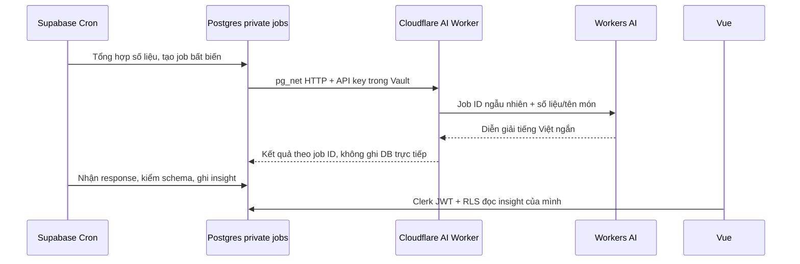

# Insight khẩu vị hằng ngày — thiết kế để duyệt

## Mục tiêu

Sau mỗi ngày làm việc, tổng hợp hành vi đặt món và feedback thành hồ sơ khẩu vị
có bằng chứng. Dùng kết quả để hiển thị món người dùng thường thích, chất lượng
từng món của từng quán và xếp gợi ý cho các menu sẵn có.

Chạy mặc định 18:00 giờ Việt Nam, thứ Hai–thứ Sáu (`0 11 * * 1-5` theo UTC).
Thời gian có thể đổi trong cấu hình vận hành. Không tạo automation của Codex.

## Phân biệt tín hiệu

- Đặt nhiều lần là thói quen lựa chọn. Chỉ gọi là thích khi có đánh giá tốt;
  ghi rõ trường hợp chưa có đánh giá, không suy ra chất lượng từ lượt đặt.
- Lấy tối đa 90 ngày, giữ quán + canonical dish riêng. Đơn đặt hộ tính cho chủ đơn.
- Sao và nhãn do người dùng chọn là nguồn bằng chứng. Ghi chú tự do giữ trong DB;
  giai đoạn đầu không gửi ghi chú, tên người, thông tin thanh toán hoặc Clerk ID sang AI.
- Khẩu vị được mô tả bằng số lần chọn nhãn, nhóm nguyên liệu/cách nấu nhận diện
  từ tên món và mức độ hài lòng. Ít dữ liệu phải hiện “Chưa đủ dữ liệu”, không
  mặc định người dùng thích cay/ngọt/mặn, không suy luận dị ứng hoặc tình trạng sức khỏe.
- Tối thiểu 3 ngày có đánh giá mới diễn đạt xu hướng; chỉ một đánh giá vẫn có thể
  hiện nguyên văn tín hiệu với số mẫu. Tất cả kết luận hiển thị kỳ dữ liệu, số mẫu,
  thời điểm cập nhật và mức độ tin cậy.

## Luồng chạy nền và bảo mật

Worker bổ sung endpoint nội bộ phục vụ job; vẫn deploy độc lập trong `ai-worker/`.
API key chỉ ở Cloudflare secret và Supabase Vault, không có trong Vue. Worker
không cần Supabase service-role/secret key và không có quyền ghi database.
Cron của Postgres được cấp đúng quyền cần để tổng hợp/ghi insight; các hàm cron
đặt trong schema private, không cấp EXECUTE cho anon/authenticated/PUBLIC.

`pg_net` gửi bất đồng bộ; poller nhận response theo request ID đã ghi trong job,
không chấp nhận user ID do AI trả về. Khi inference hết quota/lỗi/timeout, giữ
số liệu và phần diễn giải quy tắc; không đánh dấu kết luận AI đã thành công.
Job idempotent theo ngày, loại đối tượng và ID nguồn. Chỉ cập nhật job chưa xong;
giới hạn lượt retry, số đối tượng và payload. Không log API key, payload hay khẩu vị cá nhân.

## Lưu trữ mới

1. `private.lunch_insight_jobs`: đối tượng nguồn, snapshot số liệu, request ID,
   trạng thái, lượt retry và kết quả kỹ thuật; chỉ cron quản lý.
2. `public.user_taste_insights`: user ID dạng Clerk string, kỳ dữ liệu, metrics,
   summary, confidence, generated_at. RLS SELECT chỉ `user_id = auth.jwt()->>'sub'`;
   frontend không INSERT/UPDATE/DELETE.
3. `public.restaurant_insights`: restaurant ID, dish aggregates, summary, sample
   counts/confidence/generated_at. Người đăng nhập đọc thống kê nhóm; không chứa
   danh sách người đánh giá hay insight cá nhân.

Migration và cron setup cần duyệt riêng trước khi áp dụng vào Supabase dùng chung.
Không đổi quyền tự đánh dấu thanh toán/đánh giá, không thêm role admin.

## Trình bày và gợi ý món

“Khẩu vị của tôi” là mục trong lịch cơm/hồ sơ, không thêm tab thứ sáu ở mobile.
Hiện ba phần: món thường chọn, món đã đánh giá tốt và các cảm nhận thường gặp.
Biểu đồ thanh gọn, có nhãn/số đếm, không radar giả hoặc dùng màu làm tín hiệu duy nhất.

Gợi ý món chỉ lấy từ menu đang nhận đơn và món chưa hết. Xếp hạng bằng bằng chứng:
đánh giá cá nhân, lịch sử quán/món, nhóm món quen thuộc và mức độ đa dạng gần đây.
Điểm quán phải làm mượt với prior theo nhóm để một review 5 sao không đứng trên
quán có nhiều review tốt. Mỗi gợi ý ghi lý do cụ thể và số mẫu; không bịa món ngoài menu.
Khi thiếu dữ liệu, hiển thị thống kê quan sát và món được nhóm đánh giá tốt, chưa gọi
đó là gợi ý cá nhân hóa đã đủ tin cậy.

## Xác minh sau triển khai

Gom kiểm tra cuối: ownership/đặt hộ, người A không đọc insight của B; độ tin cậy
với 0/1/3 ngày đánh giá; phân biệt món trùng tên khác quán; không xếp món hết;
retry/idempotency/replay job/response sai/schema AI hỏng; giờ VN và thứ làm việc;
không gửi notes/thanh toán/Clerk ID trong inference; responsive/focus biểu đồ.
Chỉ bật lịch chạy thật sau khi migration, Vault và Worker endpoint đã kiểm xong.
